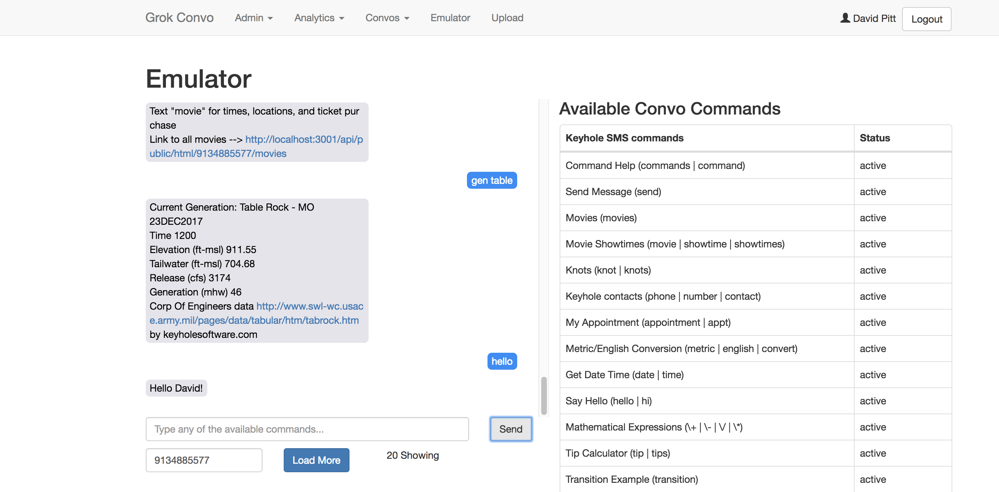
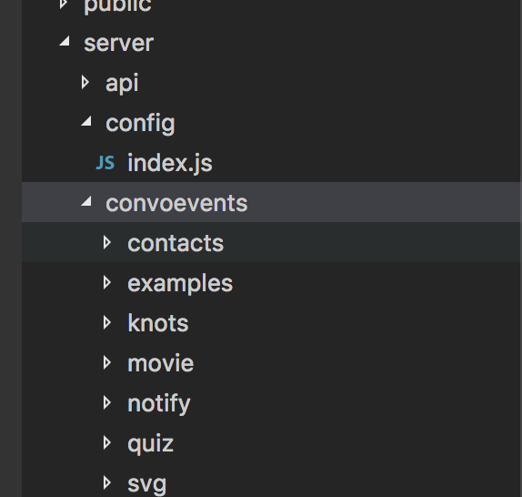

KHS{Convo} is a Node.js based platform that supports implementing SMS conversational experiences. 

*built by [Keyhole Software](https://keyholesoftware.com)*

### Topics 

##### [Examples](docs/examples.md) - Best way to learn how to implement your own conversational {KHS}Convo app

##### [UI Dashboard](docs/admin-dashboard.md) - ReactJS UI Dashboard that has features of Dynamic Loading, Analytics, and testing {KHS}Convo events  

### Installing and Getting Started

You need to have [Node.js](https://nodejs.org) installed, then follow these steps.

* npm install

* A [MongoDB](https://www.mongodb.com) instance is required. A connection URI needs to be supplied in the `server/config/index.ja` property config script. (See [MongoDB Config Doc](docs/mongodb.md) for more information)

* Create and Admin User with the following command. This will create an admin user with a userid of `admin` and prompt for a password.

    $ node aadminuser.js

* npm run startdev

This will start the API and UI servers on port 3000 and 30001 respectivley. 

The ReactJS UI Dashboard should open in a browser, if not click this link [http://localhost:3000](http://localhost:3000).

You can then login to the UI Dashboard with the `admin` userid and the password you entered.  Go to this [Link](docs/admin.md) for more information.

### SMS Emulator

KHS{Convo} SMS events can be tested from the Dashboard, by selecting the Emulator and typing 'hello' or one the Convo events listed in the emulator. 

### Your first Hello World Convo event

KHS{Convo} makes it easy to create an SMS conversation.  Follow the steps below to define and execute a simple conversational application. 

`1.` In an editor of choice, create a JS file named  `helloconvo.js` with the contents shown below. 

    var StateService = require('../../services/stateservice');

    module.exports = function (events) {

        var event = {};
        event.isAuth = false;
        event.description = 'Convo Hello';
        event.words = [{
            word: 'convo',
            value: 10
        }];

        event.states = [
            { reply: 'Hello, would you like a link to my site, (Y)es or (N)o ? ', validator: 'choice:Y,N', desc: 'Want Link' },
            {
                choices: [{ choice: 'y', reply: 'Here is your link -> https://keyholesoftware.com', postAction: 'stop' },
                { choice: 'n', reply: 'Ok, thanks for the chat, goodbye', postAction: 'stop' }]
            }
        ];

        event.run = function (request) {

            return new Promise(function (resolve, reject) {
                return resolve(StateService.doStates(event, request));
            })

        }

        events.push(event);

    }

`2.` Using the Dashboard `Upload` option, load the KHS{convo} SMS event.

Drag and drop or select `Upload` option to upload the convo JavaScript file you defined. You can put it in any folder. 
A successful upload will be indicated. 

`3.` To test, navigate to the `Emulator` view, and type in `convo` in the Emulator to invoke the uploaded convo event.  

### Event Loading Directory 

When the Dashboard is started it will automatically load KHS{Conov} events stored in the default `/server/convoevents` directory. You can see the example Convo events defined in that directory. 

An alternative directory can be specified by specifiying by specifiying it in the `server/config/index.js` property configuration module. 

    ...
    event_dir: process.env.event_dir || './server/convoevents',
    ...

Events that are successfully loaded are displayed in the `Emulator` and `Upload` dashboard views.

### Configuring SMS (Twillio)

The convo server does not require an SMS messaging provider. You can invoke server conversation api's directly through the Emulator, or directly with a tool like Postman. 

Event API's can be invoked from an SMS messaging provider, such as Twillio with the instructions shown below. 

#### [Twillio Configuration Steps](docs/twillio.md)

### API Server (Conversational API Messaging)

You can start just the API server with Convo, without the UI dashboard. This can be helpful when debugging Convo events. or invoking the Conversational Events from a Chatbot or interface other than SMS provider. 

Execute the command below from a command shell to start just the API server. Note, the API server is avalaible via Port `3001` it the Dashboard is running. This allows the API only server to be started. 

    > npm start

This will start an `Express` server on port `30001` by default. And is sometimes useful when you want to test and debug, and user Convo API's other than from an SMS provider. 

The Twillio account will forward text messages to Convo with a `POST` http API call.

Using a tool like `Postman` you can emulate a Twillio request with the following POST command

Response-Type: application/xml

* `POST` http://<server:3000>/api/convo
    + Request Body `Content-Type: application/json`
        - Body = `Hello`
        - To = `+19132703506`
        - From = `+15555555555`

The `Body` key value pair is the Convo event command. In the case above it is the `Hello` command.

Result response are returned in the format shown below. 

    + Example
        - `{"FromZip": "66839","FromState": "KS","FromCity": "BURLINGTON","Body":"Hello","FromCountry": "US","To": "+19132703506","From": "+15555555555"}`
    + Response `Content-Type: application/xml`
        - Message = `Hello! David`

## Implementing a Convo Conversational Event 

Events are JavaScript classes that are loaded at startup. Default example events can be found in the following folder. 

    /server/services/convoevents 

You can `define` convo events in the above location or define them in the `/server/convoevents` folder. In both locations events will be loaded. Loaded events can be seen and verified in the admin UI Emulator page.

The simplest example is the `hello` event.  Text "hello" to 913-270-0360 and it will answer with hello and your name. Or you can access the Convo Dashboard UI Emulator to invoke.

Here is the `/server/services/convo/events/hello.js` implementation...

    module.exports = function (events) {

        var event = {};
        event.isAuth = false;
        event.description = "Say Hello";
        event.words = [{
            word: 'hello',
            value: 10
        }, {
            word: 'hi',
            value: 10
        }]
        
        event.run = function (request) {
            return new Promise(function (resolve, reject) {
                if (request.me) {
                    return resolve("Hello " + request.me.FirstName + "!");
                } else {
                    return resolve("Hello!");
                }
            })
        }

        events.push(event);
    }

An event module `must` create an event object with the following `properties` and define the following `run` function. 

    Property      Value Desc
    --------      ----------
    isAuth        true | false, true requires request phone number to be in User Table
    description   Event Description 
    words         Array of word objects that are used to pattern match for text message to invoke command
    run           Returns a Promise performs event operation, a Request object is supplied as an argument 
    states        States for event conversation, see State Machine section below

#### Request Object 

An example request supplied to the `run` object is supplied by the Twillio API is shown below.  The additional properties in the POSTSed object are supplied by the Twillio service.  

    { phone: '9134885577',
    question: [ 'hello' ],
    rawQuestion: 'hello',
    raw: 
    { ToCountry: 'US',
        ToState: 'KS',
        SmsMessageSid: 'SM3b9226c9efdb515039079a42dd67ff47',
        NumMedia: '0',
        ToCity: '',
        FromZip: '66209',
        SmsSid: 'SM3b9226c9efdb515039079a42dd67ff47',
        FromState: 'KS',
        SmsStatus: 'received',
        FromCity: 'BURLINGTON',
        Body: 'hello',
        FromCountry: 'US',
        To: '132703506',
        MessagingServiceSid: 'MGa22831785004d7b8b013938f4882600b',
        ToZip: '20 x 10',
        NumSegments: '1',
        MessageSid: 'SM3b9226c9efdb515039079a42dd67ff47',
        AccountSid: 'AC94e84f13ebab85027b860d213b20d636',
        From: '9134885577',
        ApiVersion: '2010-04-01' },
    answer: '',
    me: 
    { _id: 596e477b8508d90888894b29,
        FirstName: 'David',
        LastName: 'Pitt',
        Name: 'David Pitt',
        Phone: '9134885577',
        uuid: '273833a7-d4e7-4e57-a2fe-d1d4be9cf88a',
        Username: 'dpitt',
        Status: 'admin' } }

Notice how the request objects properties. `The question/message` the user texted is contained in an array in the `question` property. The `me` property contains user information that texted, if they exist in the User database. 

JavaScript events have access to request objects as a parameter in the `run` function. The example snippet below show the request object in use.
   
    ...
    event.run = function (request) {
            return new Promise(function (resolve, reject) {
                if (request.me) {
                    return resolve("Hello " + request.me.FirstName + "!");
                } else {
                    return resolve("Hello!");
                }
            })
        }
    ...

## State Machine

Convo applies a state machine algorithm that simplifies impementing a conversational experience.  Event objects can be assigned an array of State definitions. A state is defined for each interaction between a users text message and the convo event.   

As an example, consider an example appointement scheduling converstation, which uses the `state machine module`. Notice the states definition for the event. 

    var StateService = require('../../stateservice');

    module.exports = function (events) {

    var event = {};
    event.states = [
            { reply: 'Your appointment is tommorrow at 1:00 pm, can you make it (Y)es or (N)o?', validator: 'choice:y,n', desc: 'Appointment' },
                {choices: [
                    { choice: 'y', reply: 'Thank you, see you at 1:00', postAction: 'cancel' },
                    { choice: 'n', reply: 'Would you like to schedule a different time (Y)es (N)o ?', validator: 'choice:y,n' }]
            },
                {choices: [
                    { choice: 'Y', reply: 'Ok, new date time', postAction: 'cancel' },
                    { choice: 'n', reply: 'Goodbye, call this number to reschedule 123-456-7890', postAction: 'cancel' }]
            }
        ];

        event.isAuth = false;
        event.description = "My Appointment";
        event.words = [{
            word: 'appointment',
            value: 10
        }, {
            word: 'appt',
            value: 10
        }]
        event.run = function (request) {
            return new Promise(function (resolve, reject) {

                return resolve(StateService.doStates(event, request));
            });
        }

        events.push(event);

    }

Here's some screen shots showing the appointmemnt events conversation...

### Making it Real

The `Appointment` convo event is just an example and has "hard coded" elements, such as the appointmemnt time for the user texting. In reality, the appointment time should be dynamically looked up, and displayed for each texting user. 

Instead of replying with a String, a function can be referenced. This function will be supplied with a request argument and state information. Here's how an appointment look up function can be applied to the convo event. 

The first element in the array, replaces the `reply` String  with a `apptLookup` function , as shown below.

     ... 
     event.states = [
        { reply: apptLookup , validator: 'choice:y,n', desc: 'Appointment' },
     ... 

The `apptLookup` function definition defined in the `Appointment.js` event module is shown below. 

    var apptLookup = function( session, request, event, data ) {

        return new Promise(function (resolve, reject) {
                request("http://somehost/appt/"+request.phone, function (error, response, body) {
                
                        return resolve("Your appointmemnt is at "+body.dateTime);
                });    

            });

    }

This state `reply` function must return a Promise and is supplied a session, request, event, and data objects for the function to ulitize. This function simply calls an API to obtain and return an appointment date/time. 

### State Transition

By Default, states transition sequentially, however they can 

### State Validation 

State tranisition, user text response to a state `reply` are validated before the next state is performed by defining a validator.  There are some built in validators for command input types. Examples are shown below.

Validate Number 

    ... 
    event.states = [
        { reply: 'Enter Number Please' , validator: 'number', desc: 'Number to enter' },
    ...        

Validate a Possible Choice

    ... 
     event.states = [
        { reply: 'Do you want to schedule appt (Y)es (N)o ?' , validator: 'choice:y,n', desc: 'Appointment' }
     ... 

#### Custom Validation 

A custom validation function can be used by creating a function visible in your `Convo Event` module. Here's an example validator function that validates a set of zip codes. Of course this could be modified to perform a lookup using an API, but for this example possible zips are hard coded. 

var zipcodeValidator =  function (session, request, event,data) {

    var zips = ["66209", "66206", "66213", "66210", "66211", "64108", "64137"];
    var zip = request.question[0];
    if (zips.indexOf(zip) >= 0) {
        return undefined;
    }
       return "Valid Zip Code Please " +zips;    
    }
     
Validation passes if `undefined` is returned. Otherwise returning a String message, which will be returned to the user, will prevent the state transition from happnening.

Here's how the custom zipcode function is applied to conversation states.

    ... 
     event.states = [
        { reply: 'Enter your zip code ?' , validator: zipcodeValidator, desc: 'Appointment' }
     ... 

#### Choice State Validation

A `choice` state validates a state reply for letters or numbers. Here's an example 

    ...
    event.states = [
            { reply: 'Your appointment is tommorrow at 1:00 pm, can you make it (Y)es or (N)o?', validator: 'choice:y,n', desc: 'Appointment' },
    ...

A choice state object is defined in an array of reply objects.  So, if Y or N is texted to Convo one the matching reply is made.  Here's how a response is made for a user to make a reply, then the choice matching the reply is returned.

...

    event.states = [
                { reply: 'Your appointment is tommorrow at 1:00 pm, can you make it (Y)es or (N)o?', validator: 'choice:y,n', desc: 'Appointment' },
    {choices: [
            { choice: 'y', reply: 'Thank you, see you on 11/1/2017 1:00', postAction: 'stop' },
            { choice: 'n', reply: 'Would you like to schedule a different Date (Y)es (N)o ?', validator: 'choice:y,n' }]
...

### Ending or Stopping a session 

KHS-Convo saves user's session reply data in a `Session` Mongodb collection. This needs to be removed when the session is done. This can be done by defining a `postAction: stop ` in the reply state. Or, can be done with code using the Session service object, like this.   

    ...
    session.Delete(request.phone);
    ...      

The user can delete a session by texting "c", which will delete the event. 

### Dynamic HTML UI 

khs{convo} can generate a link to a dynamically generated HTML user interface.  The user interface is defined as a `PUG` template.  Here's an example state definition that asks user if they want a UI link. 
    
    ...
    event.states = [
             { reply: 'Do you want a UI Link (Y)es or (N)o?', validator: 'choice:y,n', desc: 'UI' },

                    { choice: 'y', reply: generateLink , postAction: 'stop' },
                    { choice: 'n', reply: 'Goodbye...', postAction: 'stop' }]
    ...

Notice the `y` choice reply is a function generateLink definition.  Here's this function definition. 

    ...
    var generateLink = function(session,request,event) {

            var compiledFunction = pug.compileFile(template_dir+'/appointment.pug');

            var html = compiledFunction( { url: host_url} );    
            var word = event.words[0].word;
            var result = '\n Link to UI  -->\n'+host_url+'api/public/html/'+request.phone+'/'+word;
                        mongo.Update({phone: result.phone, event: word},{phone: request.phone, event: word, html: html }, "ui", {upsert: true} );   
                        
                
        return result;
    }
    ...

A PUG template file is defined in the location specified by the  `template_dir` config variable defined in the `/server/config/index.js` file. This can be overriden by an ENV variable

Here is an example `allmovies.PUG` template file. This template generates an HTML UI displaying a list of movies. 

    //- allmovies.pug
    doctype html
    html(lang="en")
    head
        title Movies
        meta(name="viewport" content="width=device-width, initial-scale=1, minimum-scale=1, maximum-scale=1, user-scalable=no")
        link(href='http://fonts.googleapis.com/css?family=Roboto', rel='stylesheet', type='text/css')
        link(href='https://cdnjs.cloudflare.com/ajax/libs/materialize/0.100.2/css/materialize.min.css', rel="stylesheet")
        link(href="https://maxcdn.bootstrapcdn.com/bootstrap/latest/css/bootstrap.min.css", rel='stylesheet')
        link(href='https://cdnjs.cloudflare.com/ajax/libs/Swiper/3.4.2/css/swiper.min.css', rel="stylesheet")
        link(href='/styles/global.css', rel='stylesheet')
        link(href='/styles/movies.css', rel='stylesheet')
    body
        .page-container

            .page-conatiner__nav-bar
                .nav-bar__title All movies

            .page-container__content
                .page-content__container

                .swiper-container
                    .swiper-wrapper
                        each movie in movies
                            .swiper-slide
                            .swiper__carousel-image(style='background-image: url(' + url + movie.image + ')')
                            span.carousel-item__description.white-text= movie.name
                            span.carousel-item__locations.white-text= movie.locations.join(', ')

                    .swiper-button-next.swiper-button-white
                    .swiper-button-prev.swiper-button-white

        script(src="https://ajax.googleapis.com/ajax/libs/jquery/1.10.2/jquery.min.js")
        script(src="https://cdnjs.cloudflare.com/ajax/libs/Swiper/3.4.2/js/swiper.min.js")
        script(type="text/javascript").
            $(document).ready( function() {

                var swiper = new Swiper('.swiper-container', {
                nextButton: '.swiper-button-next',
                prevButton: '.swiper-button-prev',
                slidesPerView: 1,
                spaceBetween: 20,
                loop: true
                });

                $(window).resize(function() {
                swiper.update();
                });

            });
    

Here's the movies PUG template rendered in a mobile browser. 

### Creating and Running with Docker
Conversational Server Implementation

- docker build --tag grokconvo .
- docker run -d -p 27017:27017 --name mongo mongo
- docker run -it -d --restart always -p3000:3000 --name grokconvo grokconvo

