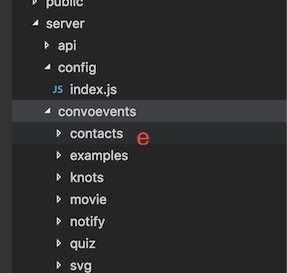
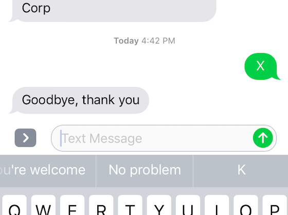

 *built by [Keyhole Software](https://keyholesoftware.com)*

KHS{Convo} is a Node.js-based platform for creating SMS and Web-based `conversational` experiences. 

## Guides 

[Examples](docs/examples.md) - Best way to learn how to implement your own conversational {KHS} Convo app.

[UI Dashboard](docs/admin-dashboard.md) - ReactJS UI Dashboard that has features of Dynamic Loading, Analytics, and testing of {KHS} Convo events.  

[Notification Center](docs/notification-center.md) - Schedule and notify users through SMS, Slack, and Email. 

[Twilio Configuration](docs/twilio.md) - Schedule and notify users through SMS, Slack, and Email. 

## Table of Contents 

* [Getting Started](#getting-started)
* [SMS/Chatbot Emulator](#sms-chatbot-emulator)
* [Configuration Properties](#configuration-properties)
* [Event Loading](#event-loading-directory)
* [Configuring SMS](#configuring-sms)
* [API Server](#api-server)
* [Implementing a Conversation](#implementing-a-conversation)
* [Conversation State Machine](#conversation-state-machine)
* [Session Management](#session-management)
* [Session Management](#session-management)
* [Starting a Conversation from an Application](#starting-a-conversation-from-an-application)
* [Timer Events](#timer-events)
* [Creating and Running with Docker](#creating-and-running-with-docker)

# Getting Started

### Install Prerequisites

* [Node.js](https://nodejs.org)
* [MongoDB](https://www.mongodb.com)
    * The directions below assume a local instance running on `localhost:27017`
    * Note: there is currently an issue with using the free mongodb atlas instance.
        * TODO: seems to be related to the ssl, but not sure  

* [Twilio](https://www.twilio.com/) account (Optional)
    * The UI Dashboard's built-in Emulator can be used to test the interactions

### Setup Environment

* After `cloning` this repository, run the command:
    > `npm install` 

* Verify / Create a MongoDB database. 
    * `khs-convo` is being used for this demo. 

* Copy the `server/config/copy-to-indexjs.tmp` file to `index.js`. This is where config properties are set. 
  
  `Note:` The index.js file is Git ignored to prevent accidental committing of configuration properties. 
    * Set the MongoDB connection URI setting `mongodb: process.env.MONGODB_URI` to your local or remote MongoDB instance ( See [MongoDB Config Doc](docs/mongodb.md) for more information )

* Create an Admin User with the following command. 
    * This will create an admin user in your MongoDB instance, with a userid of `admin` and prompt for a password. 
    > `node adminuser.js`
             
* Start the API and UI servers, they will start on 3001 and 3000 respectively. 
    > `npm run startdev`

* The ReactJS UI Dashboard should have opened in a browser. If not, click this link [http://localhost:3000](http://localhost:3001).

* You can then login to the UI Dashboard with the `admin` userid and the password you entered.  Go to this [Link](docs/admin-dashboard.md) for more information.

# SMS Chatbot Emulator

KHS{Convo} SMS events can be tested from the Dashboard by selecting the Emulator and typing 'hello' or one the Convo events listed in the emulator. 

### Your first Hello World Convo event

KHS{Convo} makes it easy to create an SMS conversations. Follow the steps below to define and execute a simple conversational application. 

`1.` In an editor of choice, create a JS file named  `helloconvo.js` with the contents shown below. 

    var StateService = require('../../services/stateservice');

    module.exports = function (events) {

        var event = {};
        event.isAuth = false;
        event.description = 'Convo Hello';
        event.words = [{
            word: 'convo',
            value: 10
        }];

        event.states = [
            { reply: 'Hello, would you like a link to my site, (Y)es or (N)o ? ', validator: 'choice:Y,N', desc: 'Want Link' },
            {
                choices: [{ choice: 'y', reply: 'Here is your link -> https://keyholesoftware.com', postAction: 'stop' },
                { choice: 'n', reply: 'Ok, thanks for the chat, goodbye', postAction: 'stop' }]
            }
        ];

        event.run = function (request) {

            return new Promise(function (resolve, reject) {
                return resolve(StateService.doStates(event, request));
            })

        }

        events.push(event);

    }

`2.` Using the Dashboard `Upload` option, load the KHS {Convo} SMS event.

Drag and drop or select `Upload` option to upload the Convo JavaScript file you defined to the `examples` directory. 
A successful upload will be indicated. 

 

`3.` To test, navigate to the `Emulator` view, and type in `convo` in the Emulator to invoke the uploaded convo event.  

# Configuration Properties

Configuration properties are defined in the  server/config/index.js file. There are default value properties supplied that can be changed or set by `Environment Variables`. Using environment variables for sensitive and environment-specific properties supports portability. 

Here are properties annotated with descriptions.

    port: process.env.PORT || 3001,
    url: process.env.HEROKU_URL || 'http://localhost:3001/' ,

    // used to encrypt admin ui JWT password
    jwt_secret: process.env.jwt_secret || 'lfanflaefknawelf',
    jwt_expires: process.env.jwt_expires || 3600,

     // UI Dashboard user password encryption key
    passwordCrypto: process.env.passwordCrypto || "k2312lk3m12l31",

    // API integration token, don't use default for production, specify one  
    api_token: process.env.api_token || 'abc',

    // MONGO DB URI
    mongodb: process.env.MONGODB_URI || 'mongodb://localhost:27017/khs-convo',

    // Even upload directory
    event_dir: process.env.event_dir || './server/convoevents',

    
    // Conversation session timeout in minutes
    session_timeout: process.env.SESSION_TIMEOUT || 5

    // Scheduled Timer properties
    timerevent_dir: './server/timerevents',
    timerevent_timerName_default: 'Unnamed Timer',
    timerevent_callbackDelay_default: 60*1000,
    timerevent_callbackMaxRun_default: 0,

    // Event upload directory 

    uploaded_event_dir: './server/services/convo/events',
    
    // PUG template directory
    template_dir: process.env.template_dir || 'server/convoevents',
    
    ping_url: process.env.PING_URL || 'http://khs-convo-dev.herokuapp.com',
    
    // Notification Slack configuration
    slack: {
        webhookUri: 'your slack webhook here',
        channel:  '<channel name>',
        userName: '<user name>',
        successMessage:  'You Success Message here',
        failureMessage: 'You failure message here '
    },

    // Twilio Configuration
    twilio: {
        accountSid: process.env.accountSid || '<twilio account sid>',
        authToken: process.env.authToken || '<twilio auth token>',
        phone: process.env.PHONE || '<twilio phone #?'
    },
   
    // SMTP Configuration 
    smtp_user: 'grokola@keyholesoftware.com',
    smtp_password: '%KeyholeGrokola',
  
# Event Loading Directory 

When the Dashboard is started, it will automatically load KHS {Convo} events stored in the default `/server/convoevents` directory. You can see the example Convo events defined in that directory. 

An alternative directory can be specified by specifiying it in the `server/config/index.js` property configuration module. 

    ...
    event_dir: process.env.event_dir || './server/convoevents',
    ...

Events that are successfully loaded are displayed in the `Emulator` and `Upload` dashboard views.

# Configuring SMS

The convo server does not require a SMS messaging provider. You can invoke server conversation APIs directly through the Emulator, or directly with a tool like Postman. 

Event APIs can be invoked from an SMS messaging provider, such as Twilio with the instructions shown below. 

#### [Twilio Configuration Steps](docs/twilio.md)

# API Server

You can start just the API server with Convo, without the UI dashboard. This can be helpful when debugging Convo events or invoking the Conversational Events from a Chatbot or interface other than SMS provider. 

Execute the command below from a command shell to start just the API server. Note: the API server is available via Port `3001` if the Dashboard is running. This allows the API only server to be started. 

    > npm start

This will start an `Express` server on port `30001` by default. And is sometimes useful when you want to test and debug end user Convo APIs other than from an SMS provider. 

The Twilio account will forward text messages to Convo with a `POST` HTTP API call.

Using a tool like `Postman`, you can emulate a Twilio request with the following POST command.

Response-Type: application/xml

* `POST` http://<server:30001>/api/convo
    + Request Body `Content-Type: application/json`
        - Body = `Hello`
        - To = `+19132703506`
        - From = `+15555555555`
        
    + Request `Header` -  Key/Value with a key named "token" with a value matching the `api_token` value in the [config file](#configuration-properties)
         - Token = `token value from config`

The `Body` key value pair is the Convo event command. In the case above it is the `Hello` command.

Result response are returned in the format shown below. 

    + Example
        - `{"FromZip": "66839","FromState": "KS","FromCity": "BURLINGTON","Body":"Hello","FromCountry": "US","To": "+19132703506","From": "+15555555555"}`
    + Response `Content-Type: application/xml`
        - Message = `Hello! David`

Here's an example `POSTMAN` screenshot that executes the `hello` Convo event. 

# Implementing a Conversation

Conversational events are JavaScript classes that are loaded at startup. Default example events can be found in the following folder.  

    /server/services/convoevents 

You can `define` convo events in the above location or define them in the `/server/convoevents` folder. In both locations events will be loaded. Loaded events can be seen and verified in the admin UI Emulator page. `Note:` this location is a [configurable](#event-loading-directory) option.

The simplest example is the `hello` event.  Text "hello" to 913-270-0360 and it will answer with hello and your name. Or you can access the Convo Dashboard UI Emulator to invoke.

Here is the `/server/services/convo/events/hello.js` implementation...

    module.exports = function (events) {

        var event = {};
        event.isAuth = false;
        event.description = "Say Hello";
        event.words = [{
            word: 'hello',
            value: 10
        }, {
            word: 'hi',
            value: 10
        }]
        
        event.run = function (request) {
            return new Promise(function (resolve, reject) {
                if (request.me) {
                    return resolve("Hello " + request.me.FirstName + "!");
                } else {
                    return resolve("Hello!");
                }
            })
        }

        events.push(event);
    }

An event module `must` create an event object with the following `properties` and define the following `run` function. 

    Property      Value Desc
    --------      ----------
    isAuth        true | false, true requires request phone number to be in User Table
    description   Event Description 
    words         Array of word objects that are used to pattern match for text message to invoke command
    run           Returns a Promise performs event operation, a Request object is supplied as an argument 
    states        States for event conversation, see State Machine section below

#### Request Object 

An example request supplied to the `run` object by the Twilio API is shown below. The additional properties in the POSTSed object are supplied by the Twilio service.  

    { phone: '9134885577',
    question: [ 'hello' ],
    rawQuestion: 'hello',
    raw: 
    { ToCountry: 'US',
        ToState: 'KS',
        SmsMessageSid: 'SM3b9226c9efdb515039079a42dd67ff47',
        NumMedia: '0',
        ToCity: '',
        FromZip: '66209',
        SmsSid: 'SM3b9226c9efdb515039079a42dd67ff47',
        FromState: 'KS',
        SmsStatus: 'received',
        FromCity: 'BURLINGTON',
        Body: 'hello',
        FromCountry: 'US',
        To: '132703506',
        MessagingServiceSid: 'MGa22831785004d7b8b013938f4882600b',
        ToZip: '20 x 10',
        NumSegments: '1',
        MessageSid: 'SM3b9226c9efdb515039079a42dd67ff47',
        AccountSid: 'AC94e84f13ebab85027b860d213b20d636',
        From: '9134885577',
        ApiVersion: '2010-04-01' },
    answer: '',
    me: 
    { _id: 596e477b8508d90888894b29,
        FirstName: 'David',
        LastName: 'Pitt',
        Name: 'David Pitt',
        Phone: '9134885577',
        uuid: '273833a7-d4e7-4e57-a2fe-d1d4be9cf88a',
        Username: 'dpitt',
        Status: 'admin' } }

Notice how the request objects properties. `The question/message` the user texted is contained in an array in the `question` property. The `me` property contains user information that was texted, if they exist in the User database. 

JavaScript events have access to request objects as a parameter in the `run` function. The example snippet below shows the request object in use.
   
    ...
    event.run = function (request) {
            return new Promise(function (resolve, reject) {
                if (request.me) {
                    return resolve("Hello " + request.me.FirstName + "!");
                } else {
                    return resolve("Hello!");
                }
            })
        }
    ...

# State Machine

Convo applies a state machine algorithm that simplifies implementing a conversational experience. Event objects can be assigned an array of State definitions. A state is defined for each interaction between a user's text message and the convo event.   

As an example, consider an example appointment scheduling conversation which uses the `state machine module`. Notice the states definition for the event. 

    var StateService = require('../../stateservice');

    module.exports = function (events) {

    var event = {};
    event.states = [
            { reply: 'Your appointment is tommorrow at 1:00 pm, can you make it (Y)es or (N)o?', validator: 'choice:y,n', desc: 'Appointment' },
                {choices: [
                    { choice: 'y', reply: 'Thank you, see you at 1:00', postAction: 'cancel' },
                    { choice: 'n', reply: 'Would you like to schedule a different time (Y)es (N)o ?', validator: 'choice:y,n' }]
            },
                {choices: [
                    { choice: 'Y', reply: 'Ok, new date time', postAction: 'cancel' },
                    { choice: 'n', reply: 'Goodbye, call this number to reschedule 123-456-7890', postAction: 'cancel' }]
            }
        ];

        event.isAuth = false;
        event.description = "My Appointment";
        event.words = [{
            word: 'appointment',
            value: 10
        }, {
            word: 'appt',
            value: 10
        }]
        event.run = function (request) {
            return new Promise(function (resolve, reject) {

                return resolve(StateService.doStates(event, request));
            });
        }

        events.push(event);

    }

Here are some screen shots showing the appointment events conversation...

### Making It Real

The `Appointment` convo event is just an example and has "hard coded" elements, such as the appointment time for the user texting. In reality, the appointment time should be dynamically looked up and displayed for each texting user. 

Instead of replying with a String, a function can be referenced. This function will be supplied with a request argument and state information. Here's how an appointment look up function can be applied to the convo event. 

The first element in the array replaces the `reply` String  with a `apptLookup` function, as shown below.

     ... 
     event.states = [
        { reply: apptLookup , validator: 'choice:y,n', desc: 'Appointment' },
     ... 

The `apptLookup` function definition defined in the `Appointment.js` event module is shown below. 

    var apptLookup = function( session, request, event, data ) {

        return new Promise(function (resolve, reject) {
                request("http://somehost/appt/"+request.phone, function (error, response, body) {
                
                        return resolve("Your appointmemnt is at "+body.dateTime);
                });    

            });

    }

This state `reply` function must return a Promise and is supplied a session, request, event, and data objects for the function to utilize. This function simply calls an API to obtain and return an appointment date/time. 

### State Transition

By Default, states transition sequentially. However, you can `jump` to different states using the `transition` property with a transistion function that returns the next state to execute. 

Here's a simple state definition example that applies a `transition function` that, based upon your birthday, determines if you are legal to drink alcohol.

      ...
       event.states = [
        { reply: 'When you where born (mm/dd/yyyy) ?', validator: 'date', state: 'ask'},
        {    
           transition:
                 function(session, request, event) {
                    var birthday = +new Date(request.question[0]);
                    var age =  ~~((Date.now() - birthday) / (31557600000));
                    return age >= 21 ? 'legal' : 'illegal'; 
                 }, state: 'calc'},
                     
        { reply: 'You are Legal to Drink', postAction: 'stop', state: 'legal'},
        { reply: 'Too young to drink, sorry', postAction: 'stop', state: 'illegal'}
    ];
    ...
    
Notice the `transition` state that defines a function, which returns a 'legal' or 'illegal' state id based upon the age caulation. The `request` convo object is provided as input. 

The complete listing for this example can be found [here](server/convoevents/examples/alcohol.js).  You can invoke from the Emulator by texting "drink". 

### State Validation 

State tranisition, user text response to a state `reply` are validated before the next state is performed by defining a validator.  There are some built-in validators for command input types. Examples are shown below.

Validate Number 

    ... 
    event.states = [
        { reply: 'Enter Number Please' , validator: 'number', desc: 'Number to enter' },
    ...        

Validate a Possible Choice

    ... 
     event.states = [
        { reply: 'Do you want to schedule appt (Y)es (N)o ?' , validator: 'choice:y,n', desc: 'Appointment' }
     ... 

#### Custom Validation 

A custom validation function can be used by creating a function visible in your `Convo Event` module. Here's an example validator function that validates a set of zip codes. Of course this could be modified to perform a lookup using an API, but for this example possible zips are hard-coded. 

var zipcodeValidator =  function (session, request, event,data) {

    var zips = ["66209", "66206", "66213", "66210", "66211", "64108", "64137"];
    var zip = request.question[0];
    if (zips.indexOf(zip) >= 0) {
        return undefined;
    }
       return "Valid Zip Code Please " +zips;    
    }
     
Validation passes if `undefined` is returned. Otherwise returning a String message, which will be returned to the user, will prevent the state transition from happening.

Here's how the custom zipcode function is applied to conversation states.

    ... 
     event.states = [
        { reply: 'Enter your zip code ?' , validator: zipcodeValidator, desc: 'Appointment' }
     ... 

#### Choice State Validation

A `choice` state validates a state reply for letters or numbers. Here's an example:

    ...
    event.states = [
            { reply: 'Your appointment is tomorrow at 1:00 pm, can you make it (Y)es or (N)o?', validator: 'choice:y,n', desc: 'Appointment' },
    ...

A choice state object is defined in an array of reply objects. So, if Y or N is texted to Convo the matching reply is made.  Here's how a response is made for a user to make a reply, then the choice matching the reply is returned.

...

    event.states = [
                { reply: 'Your appointment is tomorrow at 1:00 pm, can you make it (Y)es or (N)o?', validator: 'choice:y,n', desc: 'Appointment' },
    {choices: [
            { choice: 'y', reply: 'Thank you, see you on 11/1/2017 1:00', postAction: 'stop' },
            { choice: 'n', reply: 'Would you like to schedule a different Date (Y)es (N)o ?', validator: 'choice:y,n' }]
...

## Ending or Stopping a Session 

KHS-Convo saves user session reply data in a `Session` Mongodb collection. This needs to be removed when the session is done. This can be done by defining a `postAction: stop ` in the reply state. Or it may be done with code using the Session service object like this:

    ...
    session.Delete(request.phone);
    ...      

The user can delete a session by texting "c", which will delete the event. 

# Session Management

When a user invokes an event conversation from either Twilio SMS or from the Web UI Dashboard, the request phone number is used to identify a user request. This request is persisted in the configured MongoDB instance. 

### Timeout
If a user conversation is inactive for a period of time (default: 5 minutes), then the session and conversation will end.

Only one conversation per user session is active at a time. So the conversation has to be completed by user or a timeout before another conversation can begin.  

Users can force the end of a conversation by texting an 'x'. This will end the session so another can begin.

By default, a session time out is active for five minutes. This timeout period can be changed by setting the `session-timeout` config property in the `server/config/index.js` file.

   ...
   session_timeout: process.env.SESSION_TIMEOUT || 5
   ...

# Starting a Conversation From an Application

Users can initiate a conversational event by Texting an event word through an SMS client or the UI Dashboard. You can also start a Conversation with an API call. This enables applications to start conversations with a user base. 

The hello world conversation can be invoked with the following `Post` command:

Response-Type: application/xml

* `POST` http://<server:30001>/api/convo/sms
    + Request Body `Content-Type: application/json`
        - Body = `hello`
        - To = `+1913XXXYYYY`  Number that will recieve text conversation
        - From = `+15555555555` Twilio number you are sending message from
        
    + Request `Header` -  Key/Value with a key named "token" with a value matching the `api_token` value in the [config file](#configuration-properties)
         - Token = `token value from config`

# Dynamic HTML UI 

KHS {Convo} can generate a link to a dynamically-generated HTML user interface.  The user interface is defined as a `PUG` template.  Here's an example state definition that asks user if they want a UI link. 
    
    ...
    event.states = [
             { reply: 'Do you want a UI Link (Y)es or (N)o?', validator: 'choice:y,n', desc: 'UI' },

                    { choice: 'y', reply: generateLink , postAction: 'stop' },
                    { choice: 'n', reply: 'Goodbye...', postAction: 'stop' }]
    ...

Notice the `y` choice reply is a function generateLink definition. Here's this function definition. 

    ...
    var generateLink = function(session,request,event) {

            var compiledFunction = pug.compileFile(template_dir+'/appointment.pug');

            var html = compiledFunction( { url: host_url} );    
            var word = event.words[0].word;
            var result = '\n Link to UI  -->\n'+host_url+'api/public/html/'+request.phone+'/'+word;
                        mongo.Update({phone: result.phone, event: word},{phone: request.phone, event: word, html: html }, "ui", {upsert: true} );   
                        
                
        return result;
    }
    ...

A PUG template file is defined in the location specified by the  `template_dir` config variable defined in the `/server/config/index.js` file. This can be overridden by an ENV variable.

Here is an example `allmovies.PUG` template file. This template generates an HTML UI displaying a list of movies. 

    //- allmovies.pug
    doctype html
    html(lang="en")
    head
        title Movies
        meta(name="viewport" content="width=device-width, initial-scale=1, minimum-scale=1, maximum-scale=1, user-scalable=no")
        link(href='http://fonts.googleapis.com/css?family=Roboto', rel='stylesheet', type='text/css')
        link(href='https://cdnjs.cloudflare.com/ajax/libs/materialize/0.100.2/css/materialize.min.css', rel="stylesheet")
        link(href="https://maxcdn.bootstrapcdn.com/bootstrap/latest/css/bootstrap.min.css", rel='stylesheet')
        link(href='https://cdnjs.cloudflare.com/ajax/libs/Swiper/3.4.2/css/swiper.min.css', rel="stylesheet")
        link(href='/styles/global.css', rel='stylesheet')
        link(href='/styles/movies.css', rel='stylesheet')
    body
        .page-container

            .page-conatiner__nav-bar
                .nav-bar__title All movies

            .page-container__content
                .page-content__container

                .swiper-container
                    .swiper-wrapper
                        each movie in movies
                            .swiper-slide
                            .swiper__carousel-image(style='background-image: url(' + url + movie.image + ')')
                            span.carousel-item__description.white-text= movie.name
                            span.carousel-item__locations.white-text= movie.locations.join(', ')

                    .swiper-button-next.swiper-button-white
                    .swiper-button-prev.swiper-button-white

        script(src="https://ajax.googleapis.com/ajax/libs/jquery/1.10.2/jquery.min.js")
        script(src="https://cdnjs.cloudflare.com/ajax/libs/Swiper/3.4.2/js/swiper.min.js")
        script(type="text/javascript").
            $(document).ready( function() {

                var swiper = new Swiper('.swiper-container', {
                nextButton: '.swiper-button-next',
                prevButton: '.swiper-button-prev',
                slidesPerView: 1,
                spaceBetween: 20,
                loop: true
                });

                $(window).resize(function() {
                swiper.update();
                });

            });
    

Here's the movies PUG template rendered in a mobile browser. 

# Timer Events

KHS{Convo} Timer Events can be created to run code at any particular interval and for however long you want it to run.

### [About Time Events](docs/timerevents.md)

# Creating and Running with Docker
Conversational Server Implementation

   $ docker build --tag convo .
   
   $ docker run -d -p 27017:27017 --name mongo mongo

   $ node adminuser.js
   
   $ docker run -it -d --restart always -p3000:3000 --name convo convo

