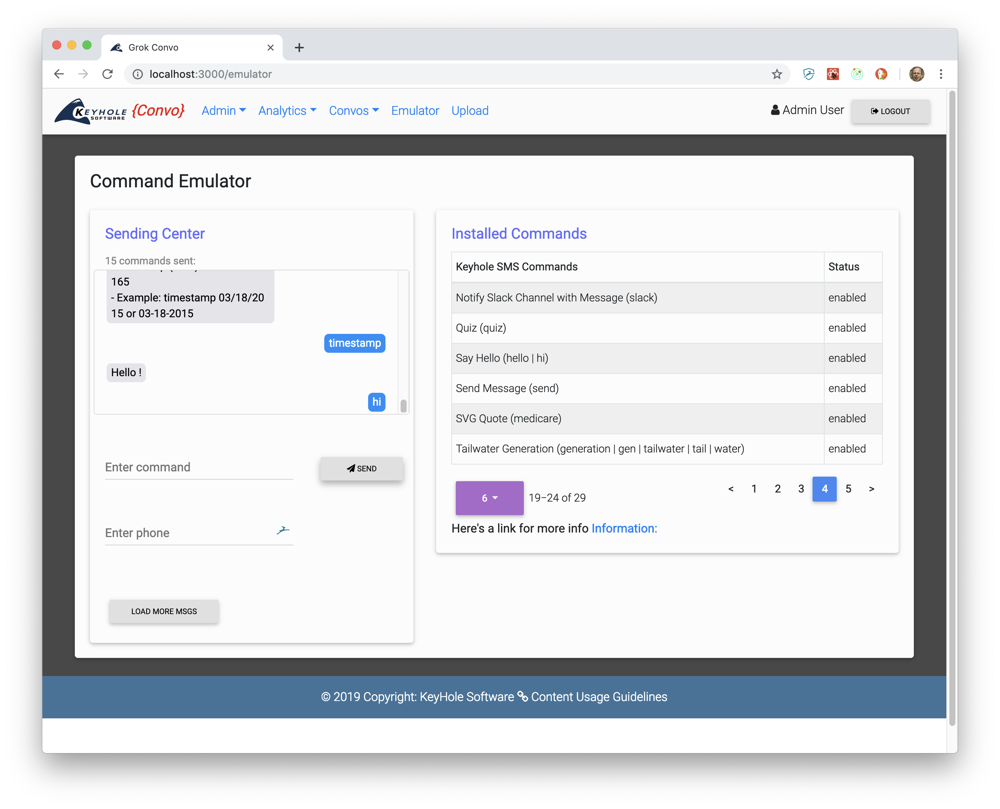

# Admin Dashboard

The Administration Dashboard is a browser baed UI implmented in [reactjS]( https://reactjs.org/). 

## Table of Contents 

* [Source Code](#source-code)
* [Users](#sms-chatbot-emulator)
* [SMS Emulator](#sms-emulator)
* [Analytics](#analytics)
* [Admin](#admin)
* [Event Upload](#upload)

# Source Code

Source code and elemeents can be found in the `src` elements. 

# Users 

There are two types of users `admin` and `active` users. Active have access to the Emulator and `Analytic` features of the Dashboar. Also, `active` users can access `KHS{Convo}` events that require authentication. 

# SMS Emulator

You can use the Emulator to interact with KHS{Convo} conversation events without an actual SMS client 

Available events with the description and key words to begin the conversation are displayed. Also, if you are an admin user,then you can enable/disable events.

# Analytics 

Event metric views are available from the `Anayltics` menu.

`Search All` - All Event SMS conversation requests made from Twilio and the Emulator can be viewed. The view displays a chronological table with date and time stamps, the phone number that made the request. 

`Group by Question` - Diplays Graph of event question word frequency.

`Group by Phone Number` - Displays graph of phone number frequency.

`Visitors` - Unique visitor phone numbers and last date/tie accessed

# Admin 

Administrative functions for adding users, managing blacklists, and Key/Value properties.

`Users` - Manage user access, change access roles, and invite users. 

`Blacklist` - Phone numbers added to the blacklist will be denied access to convo events. 

`Properties` - Configuration properties used by KHS{Convo} events. You can add, edit , and delete properties from this UI.

# Event Upload

KHS{Conov} events can be dynamically uploaded and executed through the upload UI.  Events can be uploaded to existing directories or a new directory can be created.  

Uploading can be done by clicking the Upload button next to a directory, or dragging and dropping an event. A successful upload will be indicated. 

