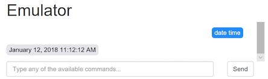
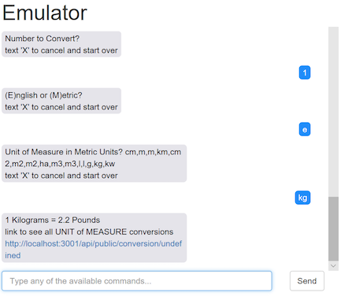

## Example Implementations 

Here are a number of examples available to try out using the Dashboard emulator. The example JavaScript implementation code can be found in this folder [Example Source](../server/convoevents/examples)

* [Appointment](#appointment) 
* [Tip Calculator](#tip-calculator)
* [Fishing Knots](#knots)
* [Date / Time](#date-time)
* [Math](#math)
* [Conversions](#conversions)

# Appointment 

### Text `appt` for a conversation confirming an appointment.  [appointment.js source](../server/convoevents/examples/appointment.js)

# Tip Calculator

### Text `tip <amount>` and tip amounts will be returned.   [tips.js source](../server/convoevents/examples/tips.js)  

# Fishing Knots 

### Text `knots` and a conversation for the type of fly fishing knot you need will occur

# Date / Time

# Math

# Conversions

### [Back to Main](https://github.com/in-the-keyhole/khs-convo) 
