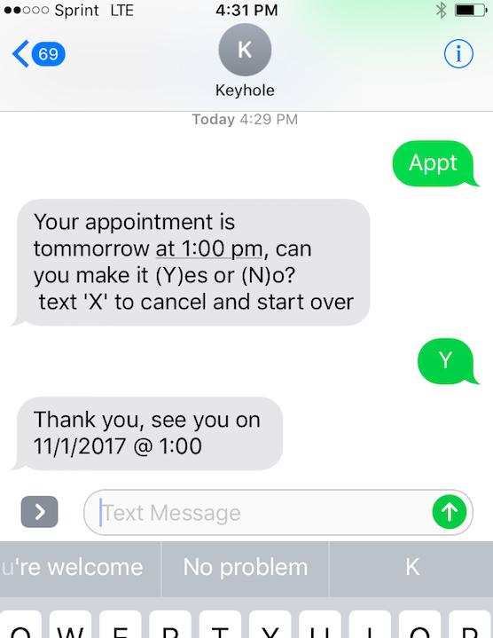
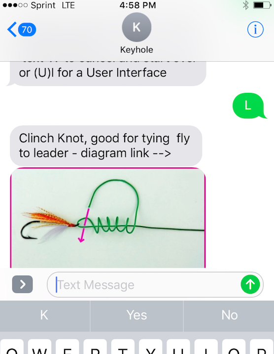
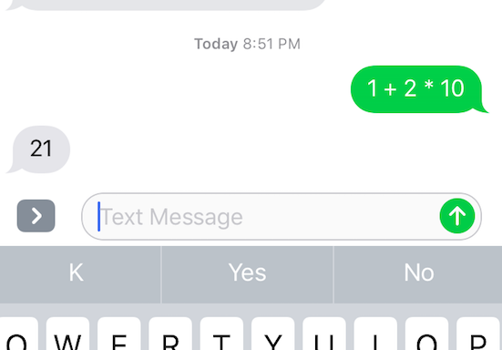

## Example Implementations 

Here are a number of examples available to try out using the Dashboard emulator or our demo number.  The example JavaScript implementation code can be found in this folder [Example Source](../server/convoevents/examples)

### Try these examples out by texting to ## (913) 270-0360

* [Appointment](#appointment) 
* [Tip Calculator](#tip-calculator)
* [Fly Fishing Knots](#fly-fishing-knots)
* [Movies](#movies)
* [Math](#math)
* [Conversions](#conversions)

# Appointment 

### Text `appt` for a conversation confirming an appointment.  [appointment.js source](../server/convoevents/examples/appointment.js)

# Tip Calculator

### Text `tip <amount>` and tip amounts will be returned.   [tips.js source](../server/convoevents/examples/tips.js)  

# Fly Fishing Knots 

### Text `knots` and a conversation for the type of fly fishing knot you need will occur

# Movies

### Text `movies` and a conversation about movie and showtimes will occur

# Math

### Text math expression  `1 * 2 * 10 ` evaluated results will be returned.  [math.js source](../server/convoevents/examples/math.js)  

# Conversions

### Text `convert` for a metric to english units,or vis versa, conversation. [conversion.js](../server/convoevents/examples/conversion.js)

