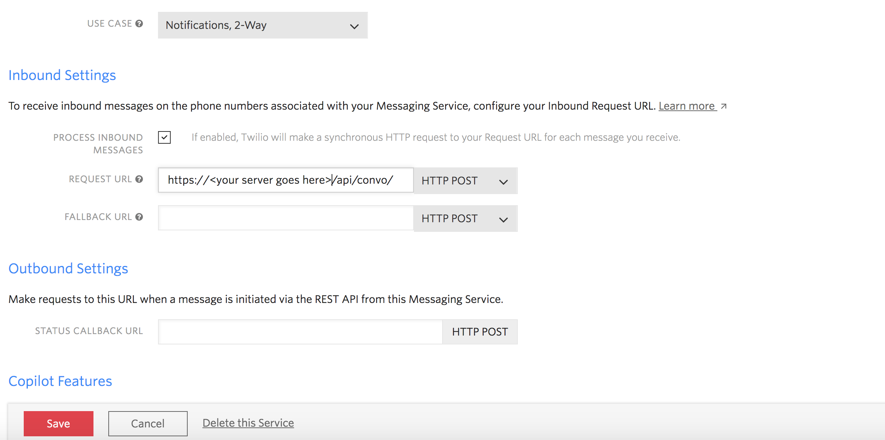

# Twilio Integration 

KHS{Convo} is integreated with SMS capability the [Twilio](http://twilio.com) api SMS services.    

This is done by configuring Twilio to route SMS messages to a running KHS{Convo} 
instance.  KHS{Convo} will execute a matching event and return a result through Twilio to the SMS device, as is depicted below. 

 
## Configuring Twilio to forward to KHS{Convo}

Here are the steps to configure a Twilio SMS service that points to KHS{Convo}

`1.` Login into your Twilio account. 

`2.` Navigate to your `console`

`3.` Click `All Products and Services` and select `Programmable SMS`

`4.` Select `Messaging Service` 

`5.` Click the `+` add button, and enter the following 

     `Use Case:` Notitifcations 2 - Way

`6.` Enter the configuration options shown below, and `save`.

     

## Configuring KHS{Convo} 

KHS{Convo} will send SMS messages using the Twilio node.js client. 

To point KHS{Convo} to your `twilio account`, you will need to configure the `twilio` configuration properties in the `server/config/index.js`, Add the twilio configuration properties as shown below.  

     ...
     twilio: {
        accountSid: process.env.accountSid || '<twilio account sid>',
        authToken: process.env.authToken || '<twilio auth token>',
        phone: process.env.PHONE || '<twilio phone #>'
     },
     ...
